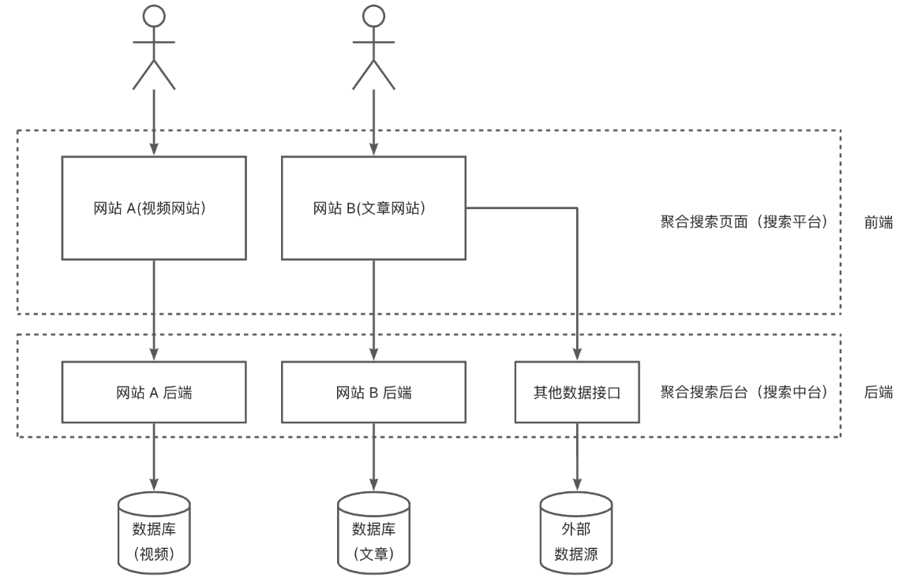
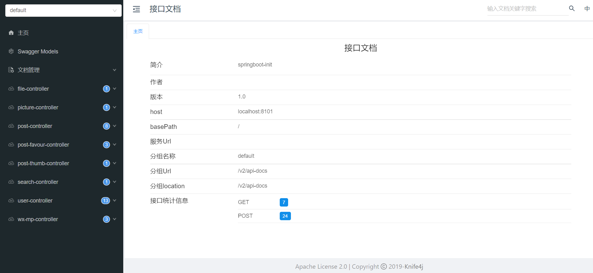
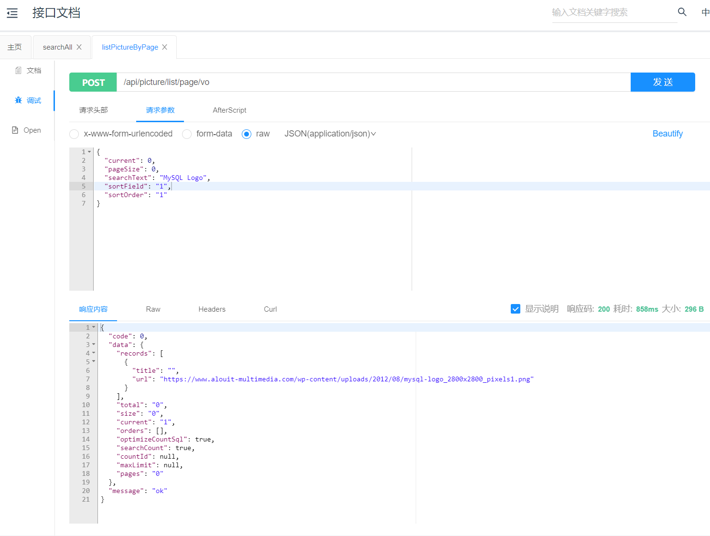
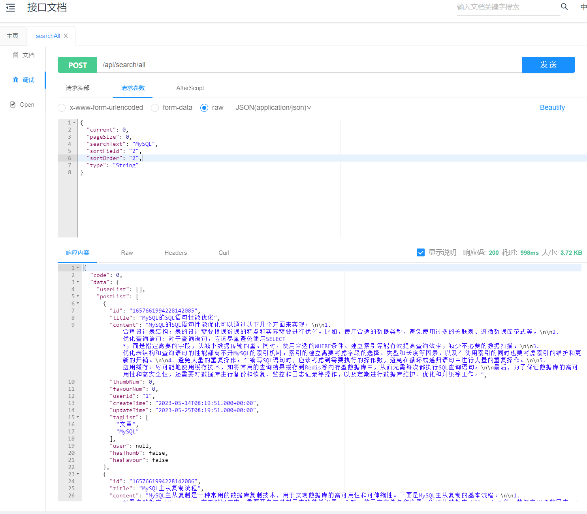
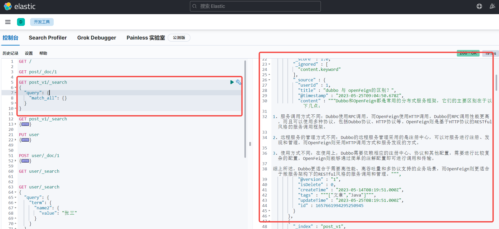
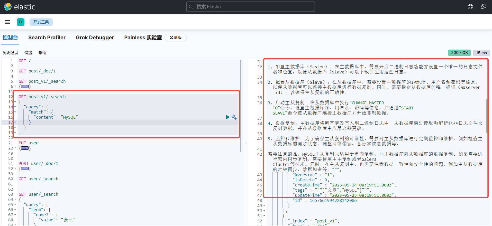
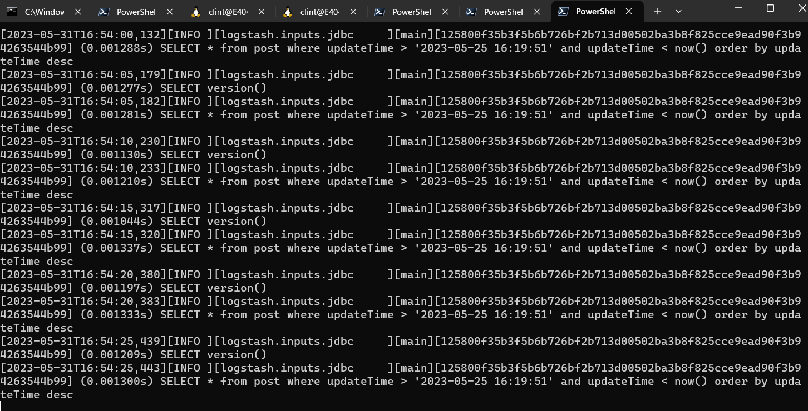
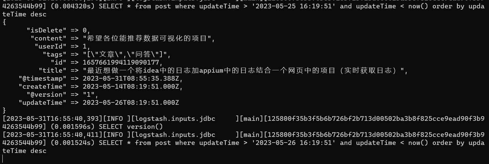

# 聚合搜索平台

## 1. 项目介绍

​		基于 Spring Boot 的一站式聚合搜索平台。用户可在同一页面集中搜索出不同来源、不同类型的内容（用户、文章、专栏、图片等），提升搜索速度。

## 2. 项目架构

​		Spring Boot、Mybatis-Plus、Redis、MySQL、Swagger-UI、Elasticsearch、Logstash、Canal（Alibaba）

## 3. 主要工作

1. 数据源获取（两种方案）：
   1. 使用 HttpClient 请求获取外部网站的文章，并使用 Hutool 的 JSONUtil 解析和预处理文章，最终入库；
   2. 使用 jsoup 实时请求 bing 搜索接口获取图片，并使用 CSS Selector 语法解析和预处理图片信息，最终返回给前端。

2. 为实现多类数据源的整体搜索，使用门面模式在后端对各类数据源的搜索结果进行聚合，统一返回给前端，减少了前端请求次数（N 次到 1 次）以及前端开发复杂度。并通过 CompletableFuture 并发搜索各数据源进一步提升搜索接口性能；

3. 为减少代码的圈复杂度，使用注册器模式代替 if else 来管理多个数据源对象，调用方可根据名称轻松获取对象；

4. 为解决文章搜不出的问题，自主搭建 Elasticsearch 来代替 MySQL 的模糊查询，并通过为索引绑定 ik 分词器实现了更灵活的分词搜索；

5. 构建 ES 文章索引时，采用动静分离的策略，只在 ES 中存储要检索的、修改不频繁字段（比如文章）用于检索，而修改频繁的字段（比如点赞数）从数据库中关联查出，从而减少了 ES 数据更新和同步的成本、保证数据一致性；

6. 数据同步（两种方案）：
   1. 自主搭建 Logstash 实现每分钟同步 MySQL 的文章数据到 ES，并通过指定 tracking_column 为更新时间字段，解决重复更新的问题；
   2. 通过 Canal（Alibaba） 监听 MySQL，并将数据实时同步到 Elasticsearch，保证数据一致性。

## 4. 项目展示

### 1. 部分接口

### 2. 搜索结果

### 3. 数据同步

